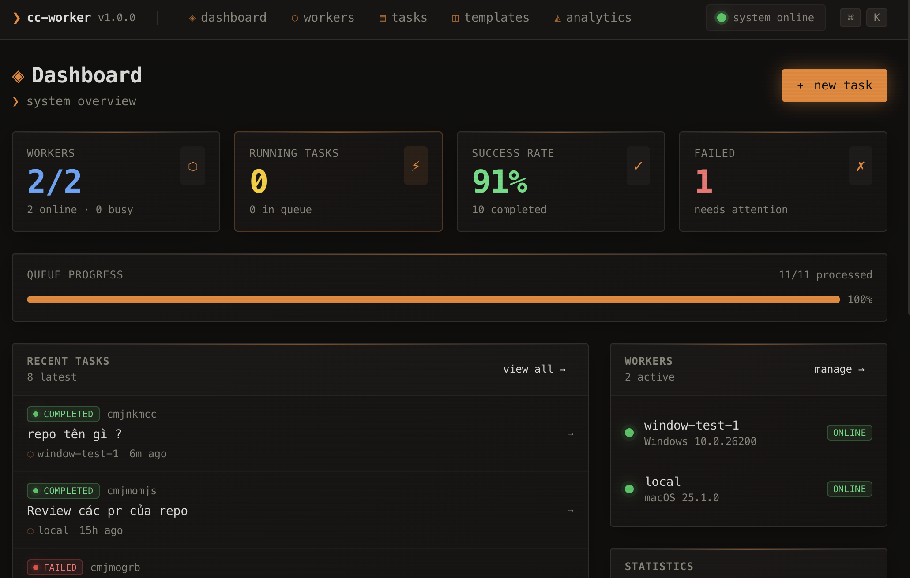
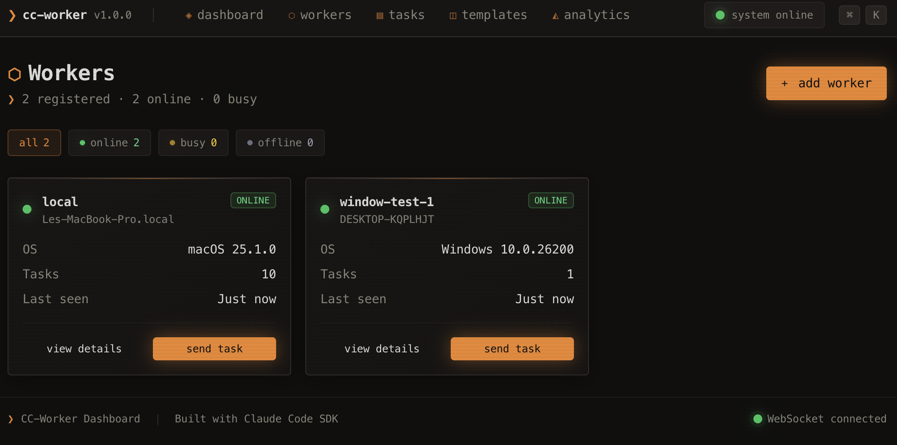

<p align="center">
  
</p>

<h1 align="center">CC-Worker</h1>

<p align="center">
  <strong>Distributed Claude Code Task Runner</strong>
</p>

<p align="center">
  <a href="#screenshots">Screenshots</a> •
  <a href="#features">Features</a> •
  <a href="#quick-start">Quick Start</a> •
  <a href="#remote-workers">Remote Workers</a> •
  <a href="#architecture">Architecture</a> •
  <a href="#documentation">Docs</a>
</p>

<p align="center">
  
  
  
</p>

---

## Screenshots

<p align="center">
  
  <br>
  <em>Real-time Dashboard - Monitor tasks and workers</em>
</p>

<p align="center">
  
  <br>
  <em>Worker Terminal - Claude Code execution logs</em>
</p>

---

## Overview

CC-Worker is a distributed system for running [Claude Code](https://docs.anthropic.com/en/docs/claude-code/overview) tasks remotely. It enables teams to:

- 🚀 **Scale Claude Code execution** across multiple workers
- 📊 **Monitor tasks in real-time** via a web dashboard
- 🔄 **Distribute workloads** with automatic task queuing
- 📝 **Track execution logs** with full streaming support

## Features

| Feature | Description |
|---------|-------------|
| **Real-time Dashboard** | Next.js web UI with live task status and logs |
| **Worker Management** | Register, monitor, and manage remote workers |
| **Task Queue** | Priority-based task scheduling and distribution |
| **Live Streaming** | WebSocket-based log streaming to browser with immediate display |
| **Cross-platform Workers** | Build workers for macOS, Windows, and Linux |
| **Claude Code SDK** | Native integration with Anthropic's Claude Code |
| **Task Management** | Retry and delete failed tasks functionality |
| **Custom CLI Path** | Support for custom Claude CLI path configuration |
| **Windows Support** | Enhanced Windows binary build and path normalization |

## Quick Start

### Prerequisites

- Node.js >= 18.0.0
- PostgreSQL database
- Claude Code CLI installed and authenticated (`claude login`)

### 1. Clone the repository

```bash
git clone https://github.com/vulh1209/cc-worker.git
cd cc-worker
```

### 2. Setup the Server

```bash
# Install pnpm if not already installed
npm install -g pnpm

# Install all dependencies (from root)
pnpm install

# Setup server
cd cc-server
cp .env.example .env
# Edit .env with your DATABASE_URL
pnpm run db:push
pnpm run dev
```

Server will start at `http://localhost:3000`

### 3. Expose Server with ngrok (Optional)

If you need to connect remote workers to your local server, use [ngrok](https://ngrok.com/) to create a secure tunnel:

```bash
# Install ngrok (if not already installed)
# macOS
brew install ngrok

# Windows (with chocolatey)
choco install ngrok

# Or download from https://ngrok.com/download
```

```bash
# Authenticate ngrok (one-time setup)
ngrok config add-authtoken YOUR_AUTH_TOKEN
```

```bash
# Start ngrok tunnel to expose port 3000
ngrok http 3000
```

ngrok will provide a public URL like `https://abc123.ngrok-free.app`. Use this URL as `CC_SERVER_URL` in your remote workers.

**Example ngrok output:**
```
Forwarding    https://abc123.ngrok-free.app -> http://localhost:3000
```

> **Tips:**
> - Free ngrok accounts get random URLs that change on restart. Consider a paid plan for stable URLs.
> - For production, deploy cc-server to a cloud provider instead of using ngrok.
> - ngrok URLs work with both HTTP and WebSocket connections (Socket.io).

### 4. Setup a Worker

```bash
cd cc-worker
cp .env.example .env
# Edit .env with server URL and API key
pnpm run dev
```

## Remote Workers

This section covers how to connect workers running on different machines to your cc-server.

### Using ngrok for Development

When your server runs locally and workers are on remote machines:

```
┌──────────────────┐         ┌─────────────┐         ┌──────────────────┐
│  Remote Worker   │◄───────►│    ngrok    │◄───────►│  Local Server    │
│  (any machine)   │  HTTPS  │   tunnel    │  HTTP   │  (your laptop)   │
└──────────────────┘         └─────────────┘         └──────────────────┘
```

**On the server machine:**
```bash
# Start cc-server
cd cc-server && pnpm run dev

# In another terminal, start ngrok
ngrok http 3000
# Copy the https URL (e.g., https://abc123.ngrok-free.app)
```

**On the remote worker machine:**
```bash
# Configure worker to use ngrok URL
export CC_SERVER_URL=https://abc123.ngrok-free.app
export CC_API_KEY=your-api-key
export CC_WORKER_NAME=remote-worker-1
export CC_WORKING_DIR=/path/to/workspace

# Start worker
cd cc-worker && pnpm run dev
```

### Configuration File

Instead of environment variables, you can use a JSON config file. This is useful for per-repository configurations.

**Config file locations (checked in order):**
1. `./cc-worker.config.json` - Project-specific config
2. `./.cc-worker.json` - Hidden project config
3. `~/.cc-worker/config.json` - Global user config

**Example `cc-worker.config.json`:**
```json
{
  "serverUrl": "https://abc123.ngrok-free.app",
  "apiKey": "your-api-key",
  "workerName": "my-project-worker",
  "workingDirectory": "/path/to/workspace",
  "cliPath": "/usr/local/bin/claude"
}
```

| Field | Required | Description |
|-------|----------|-------------|
| `serverUrl` | Yes | CC-Server URL (ngrok or production) |
| `apiKey` | Yes | Worker API key from dashboard |
| `workerName` | Yes | Display name for this worker |
| `workingDirectory` | Yes | Directory where Claude executes tasks |
| `cliPath` | No | Custom path to Claude CLI (auto-detected if not set) |

> **Priority:** Environment variables override JSON config values. This allows you to commit a base config and override secrets via env vars.

**Per-repository setup example:**
```bash
# In your project directory
echo '{
  "serverUrl": "https://your-server.com",
  "apiKey": "'$CC_API_KEY'",
  "workerName": "project-x-worker",
  "workingDirectory": "'$(pwd)'"
}' > cc-worker.config.json

# Run worker (will use local config)
cc-worker
```

### Using Pre-built Binaries

For easier deployment, download pre-built worker binaries from the [releases page](https://github.com/vulh1209/cc-worker/releases):

| Platform | Binary |
|----------|--------|
| macOS (Intel) | `cc-worker-macos-x64` |
| macOS (Apple Silicon) | `cc-worker-macos-arm64` |
| Windows | `cc-worker-win-x64.exe` |
| Linux | `cc-worker-linux-x64` |

```bash
# Example: Run on Linux
chmod +x cc-worker-linux-x64
CC_SERVER_URL=https://your-server.com CC_API_KEY=xxx ./cc-worker-linux-x64
```

### Production Deployment

For production environments, deploy cc-server to a cloud provider:

| Provider | Recommended For |
|----------|----------------|
| [Vercel](https://vercel.com) | Quick deployment (needs separate WebSocket server) |
| [Railway](https://railway.app) | Full-stack with PostgreSQL |
| [Fly.io](https://fly.io) | Global edge deployment |
| [DigitalOcean](https://digitalocean.com) | VPS with full control |

> **Note:** Since cc-server uses Socket.io for real-time communication, ensure your hosting supports WebSocket connections.

## Architecture

```
┌─────────────┐     Socket.io      ┌─────────────┐     Socket.io      ┌─────────────┐
│   Browser   │◄──────────────────►│  CC-Server  │◄──────────────────►│  CC-Worker  │
│  (Dashboard)│                    │  (Next.js)  │                    │   (Node.js) │
└─────────────┘                    └──────┬──────┘                    └──────┬──────┘
                                          │                                  │
                                          ▼                                  ▼
                                   ┌─────────────┐                    ┌─────────────┐
                                   │ PostgreSQL  │                    │ Claude Code │
                                   │  Database   │                    │    SDK      │
                                   └─────────────┘                    └─────────────┘
```

### Communication Flow

1. **Browser** creates task via API → Task saved as `PENDING`
2. **TaskQueue** processor finds available worker and assigns via WebSocket
3. **Worker's TaskExecutor** calls Claude Code SDK's `query()` function
4. **Logs stream** back via `task:log` events to subscribed browsers
5. **Final result** sent via `task:completed` or `task:failed`

## Project Structure

```
cc-worker/
├── cc-server/          # Next.js dashboard & API server
│   ├── src/
│   │   ├── app/        # Next.js App Router pages
│   │   ├── components/ # React components
│   │   └── lib/        # Server utilities & WebSocket
│   └── prisma/         # Database schema & migrations
│
├── cc-worker/          # Worker bot executable
│   └── src/
│       ├── core/       # Task executor & socket handler
│       └── utils/      # Config & logging utilities
│
└── docs/               # Additional documentation
```

## Recent Updates (December 26, 2024)

- **Improved Log Streaming**: Logs now stream immediately when navigating to task detail pages
- **Custom CLI Path**: Workers can now specify custom Claude CLI path for different environments
- **Windows Enhancements**: Better Windows binary build support with path normalization
- **Task Management**: Added retry and delete buttons for failed tasks
- **Config Security**: Worker configuration now masks secrets in logs for better security

## Documentation

- [Server Documentation](./cc-server/README.md)
- [Worker Documentation](./cc-worker/README.md)
- [API Reference](./docs/api.md) *(coming soon)*
- [Deployment Guide](./docs/deployment.md) *(coming soon)*

## Contributing

We welcome contributions! Please see our [Contributing Guide](CONTRIBUTING.md) for details.

Before contributing, please read our [Code of Conduct](CODE_OF_CONDUCT.md).

## Security

For security concerns, please see our [Security Policy](SECURITY.md).

## License

This project is licensed under the MIT License - see the [LICENSE](LICENSE) file for details.

---

<p align="center">
  Made with ❤️ by the CC-Worker community
</p>
